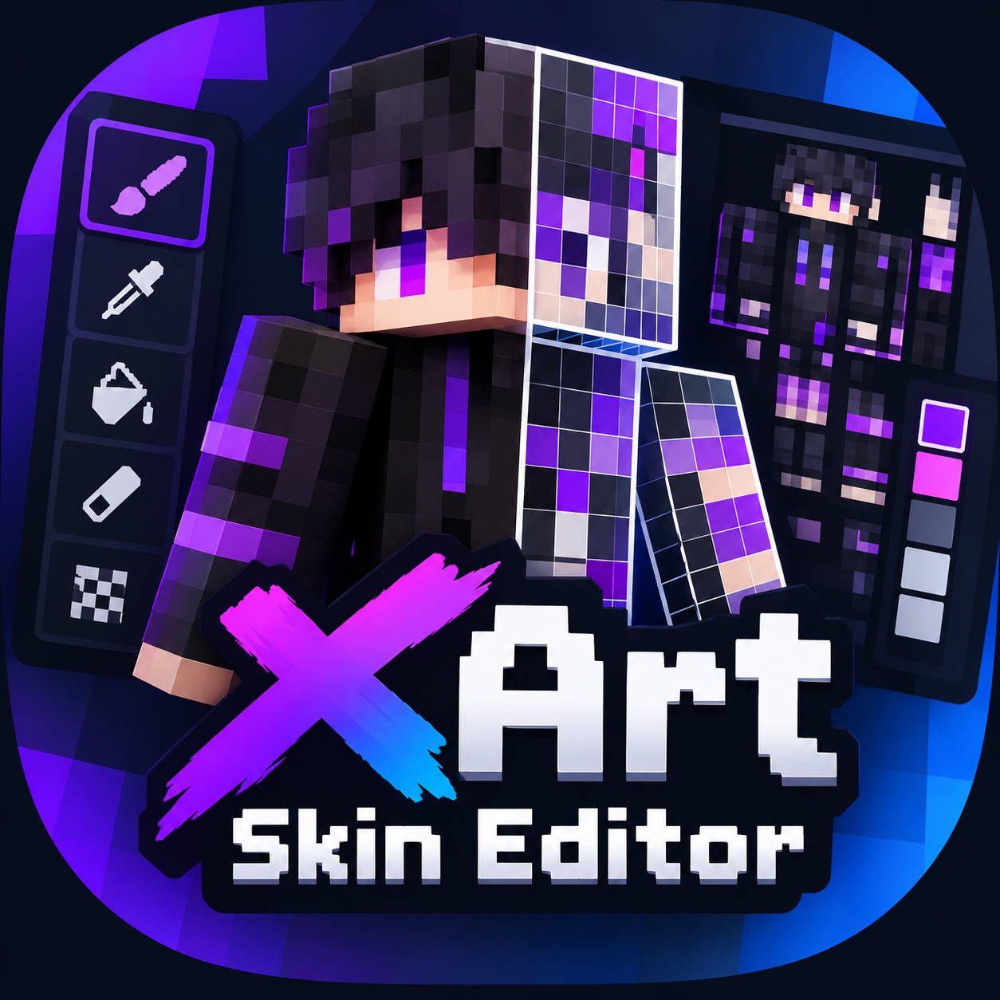
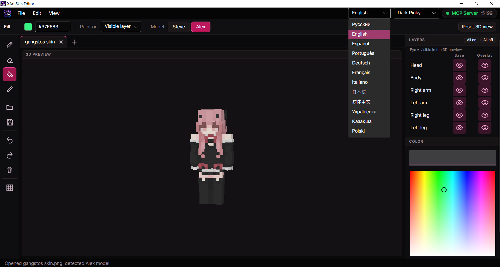

<p align="center">
  
</p>

<h1 align="center">XArt Skin Editor</h1>

<p align="center">
  A Minecraft skin editor with a 3D preview, tabs and a built-in <b>MCP server</b><br>
  that lets an AI agent (such as Claude Code) paint skins for you.
</p>

<p align="center">
  <b>English</b> · <a href="README.ru.md">Русский</a> · <a href="https://github.com/Gangstos/XArt-Skin-Editor/releases/latest">Download</a> · <a href="LICENSE">MIT License</a>
</p>

<p align="center">
  
</p>

---

## Contents

[Features](#features) · [Requirements](#requirements) · [Build](#build) · [**MCP server**](#mcp-server) · [Controls](#controls) · [Data and options](#data-and-options) · [Project layout](#project-layout) · [Status and limitations](#status-and-limitations) · [License](#license)

---

## Features

**Painting**
- 64×64 skin canvas (Minecraft 1.8+ format) with transparency.
- Pencil, eraser, fill and color picker. Right mouse button erases on the skin map; the middle button picks a color with any tool.
- **Lighten / Darken** brush: makes pixels lighter or darker while keeping their hue and transparency. Left mouse button lightens, right mouse button darkens; set the strength (1–50%) in the options bar. One stroke changes each pixel once. With this brush, right-dragging on empty space still rotates the 3D view.
- Color picker with alpha and manual hex input: `#RRGGBB`, `#RGB` or `#RRGGBBAA`.
- Undo and redo (100 steps per tab).

**3D preview**
- Rotate (right mouse button) and zoom (mouse wheel) a player model.
- **Paint directly on the 3D model.** The pixel under the cursor is highlighted on both the model and the skin map.
- **Steve** (4 px arms) and **Alex** (3 px arms) models. The model is detected automatically when you open a PNG.
- Visibility of **each body part** (head, body, arms, legs) and of **each overlay layer** (hat, jacket, sleeves, pants) is toggled independently in the Layers panel.
- "Paint on" mode: visible layer / base only / overlay only.

**Files and tabs**
- Open and save PNG. Several files can be opened at once, each in its own tab.
- Several skins side by side in tabs, each with its own undo history, model and layer visibility. Double-click renames a tab, middle-click closes it.
- The skin map (64×64 layout) is hidden by default and can be shown from the toolbar or the View menu.

**Autosave**
- Tabs are saved in the background a few seconds after every edit and **restored on the next launch**, even after a crash or power loss.

**Interface**
- Dark UI in the style of graphic editors: tools on the left, panels on the right, tabs on top.
- 12 languages: English (default), Russian, Spanish, Portuguese, German, French, Italian, Japanese, Simplified Chinese, Ukrainian, Kazakh, Polish. Switch language at any time from the top bar.
- **Color palette**: save as many as 48 colors under the color picker. Click a swatch to switch to it (or press `1`–`9` for the first nine), **+** adds the current color, right-click removes one. The palette is remembered between launches.
- 3 color themes: **Classic Purple** (default), **Dark Pinky** (black with pink accents) and **Sun White** (light, warm amber). Switch from the top bar; the choice is remembered.

**MCP server** (off by default) — 21 tools for AI agents. See [MCP server](#mcp-server).

---

## Requirements

Running a built app needs nothing installed: the `--self-contained` build already includes .NET. On Linux a few system libraries are required (see [Linux](#linux)).

Building from source needs:

| What | Link |
|---|---|
| **.NET SDK 10** | <https://dotnet.microsoft.com/download/dotnet/10.0> |
| Git (optional, to clone the repo) | <https://git-scm.com/downloads> |

Install .NET SDK 10:
- **Windows:** the installer above, or `winget install Microsoft.DotNet.SDK.10`
- **macOS:** the installer above, or `brew install --cask dotnet-sdk` ([Homebrew](https://brew.sh))
- **Linux:** <https://learn.microsoft.com/dotnet/core/install/linux>

NuGet packages are downloaded automatically on the first build:

| Library | Purpose |
|---|---|
| [Avalonia 12](https://avaloniaui.net) | cross-platform UI |
| [SkiaSharp](https://github.com/mono/SkiaSharp) | PNG handling |
| [ModelContextProtocol C# SDK](https://github.com/modelcontextprotocol/csharp-sdk) | MCP server |

---

## Build

Prebuilt archives for Windows, Linux and macOS are on the [Releases page](https://github.com/Gangstos/XArt-Skin-Editor/releases/latest). To build from source, run these from the project folder.

**Run from source (any OS)**

```bash
dotnet run
```

### Windows

```bash
dotnet publish -c Release -r win-x64 --self-contained -p:PublishSingleFile=true -o out/win-x64
```

Run `out/win-x64/XArtSkinEditor.exe`.

### Linux

```bash
dotnet publish -c Release -r linux-x64 --self-contained -p:PublishSingleFile=true -o out/linux-x64
chmod +x out/linux-x64/XArtSkinEditor
./out/linux-x64/XArtSkinEditor
```

For ARM use `-r linux-arm64`. On Debian/Ubuntu the required libraries are usually:

```bash
sudo apt install libx11-6 libice6 libsm6 libfontconfig1 libicu-dev
```

Other distributions: <https://docs.avaloniaui.net/docs/deployment/>

### macOS

```bash
# Apple Silicon (M1 and newer)
dotnet publish -c Release -r osx-arm64 --self-contained -p:PublishSingleFile=true -o out/osx-arm64

# Intel
dotnet publish -c Release -r osx-x64 --self-contained -p:PublishSingleFile=true -o out/osx-x64

chmod +x out/osx-arm64/XArtSkinEditor
./out/osx-arm64/XArtSkinEditor
```

If macOS blocks the app, clear the quarantine flag: `xattr -dr com.apple.quarantine out/osx-arm64`.
The result is a plain executable, not an `.app` bundle; bundling and signing are described in the [Avalonia macOS guide](https://docs.avaloniaui.net/docs/deployment/macOS).

### Publish output

The output is a **folder**, not a single file: native rendering libraries (`libSkiaSharp`, `libHarfBuzzSharp`, …) sit next to the executable, so copy the whole folder. Add `-p:DebugType=None -p:DebugSymbols=false` to skip the ~100 MB of `.pdb` files.

---

## MCP server

**Model Context Protocol (MCP)** is an open protocol that lets AI applications call tools in other programs ([modelcontextprotocol.io](https://modelcontextprotocol.io)).

XArt Skin Editor has an MCP server built in. An agent connects to the **running editor**, calls the drawing tools, and you **watch the skin appear live**. You can paint over it or press Undo at any moment.

### Turn it on

The server is **off by default**: the top bar shows a red **MCP Server · off** indicator.

1. Click the indicator.
2. Choose a port (default **5199**, range 1024–65535).
3. Click **Start server**. The indicator turns green and shows the port.

The same window shows the endpoint and a ready-to-copy connect command. Click **Stop server** to turn it off. If the port is busy, the indicator stays red and the window says so; pick another port.

Start it without clicking: `XArtSkinEditor --mcp-port 5199`.

| | |
|---|---|
| Transport | Streamable HTTP |
| Endpoint | `http://127.0.0.1:5199/mcp` (your port) |
| Reachable from | this computer only (`127.0.0.1`) |

### Connect an agent

Start the editor and the server first, then connect.

The server window has an **agent picker**: choose your client and it shows the exact command or config for your port, with a Copy button. The same snippets by hand (replace the port if you changed it):

**Claude Code** ([docs](https://docs.claude.com/en/docs/claude-code/overview)). Check it with `/mcp`:

```bash
claude mcp add --transport http xart-skin http://127.0.0.1:5199/mcp
```

**Gemini CLI** ([docs](https://github.com/google-gemini/gemini-cli)):

```bash
gemini mcp add --transport http xart-skin http://127.0.0.1:5199/mcp
```

**Cursor** ([docs](https://docs.cursor.com/context/mcp)): `~/.cursor/mcp.json` (all projects) or `.cursor/mcp.json` (one project):

```json
{
  "mcpServers": {
    "xart-skin": { "url": "http://127.0.0.1:5199/mcp" }
  }
}
```

**GitHub Copilot in VS Code** ([docs](https://code.visualstudio.com/docs/copilot/customization/mcp-servers)): `.vscode/mcp.json`, then use Copilot Chat in **Agent** mode:

```json
{
  "servers": {
    "xart-skin": { "type": "http", "url": "http://127.0.0.1:5199/mcp" }
  }
}
```

**Antigravity** ([site](https://antigravity.google)): open the MCP servers menu in the agent panel, choose *Manage MCP Servers → View raw config* (`mcp_config.json`) and add:

```json
{
  "mcpServers": {
    "xart-skin": { "serverUrl": "http://127.0.0.1:5199/mcp" }
  }
}
```

**ChatGPT** ([docs](https://platform.openai.com/docs/guides/developer-mode)) runs in the cloud and cannot reach `127.0.0.1`. It needs a public HTTPS address, so you have to open a tunnel, for example with [cloudflared](https://developers.cloudflare.com/cloudflare-one/connections/connect-networks/downloads/):

```bash
cloudflared tunnel --url http://127.0.0.1:5199
```

Then in ChatGPT enable developer mode and add a connector (Settings → Connectors) with the printed `https://….trycloudflare.com` address plus `/mcp`. **Read Security below first:** the server has no password, so anyone who learns the tunnel URL can draw in your editor. Close the tunnel when you finish.

Any other client that supports MCP over HTTP (Streamable HTTP) works the same way with the endpoint above.

> Menu names and config keys of these tools change between versions. If a snippet does not work, check the client's own MCP docs: the endpoint and the transport (Streamable HTTP) stay the same.

### Security

- The server listens on `127.0.0.1` only.
- There is **no authentication**: any program on your computer that knows the port can draw in the editor. Do not expose the port (port forwarding, tunnels) except briefly for ChatGPT, as described above.
- File access is limited to `load_png` and `export_png`, on the path the agent passes.
- Turn the server off when you do not need it.

### Tools (21)

All drawing tools act on the **active tab**.

| Tool | Description |
|---|---|
| `get_skin_layout` | Describes the 64×64 skin layout: where the head, body, arms and legs (base and overlay) are. **Call it first.** |
| `get_canvas_image` | The canvas as a PNG so the agent can see it. `scale` 1–16 enlarges it. |
| `get_model_preview` | Renders the skin on the 3D model (respects Steve/Alex and hidden parts) as a PNG. `yaw` (0 front, 90 left side, 180 back), `pitch`, `width`, `height`. |
| `get_pixel` | Reads one pixel. |
| `set_pixel` | Sets one pixel (replaces, no blending). |
| `set_pixels` | Sets many pixels in one undo step, as `"x,y,#color"`. Prefer it over repeated `set_pixel`. |
| `fill_rect` | Fills a rectangle (clipped to the canvas). |
| `draw_line` | Draws a 1 px line. |
| `flood_fill` | Paint bucket: fills a contiguous area of one color. |
| `clear_canvas` | Makes the whole canvas transparent (undoable). |
| `undo`, `redo` | One agent command is one undo step. |
| `load_png` | Replaces the canvas with a PNG from disk (absolute path) and detects Steve/Alex. |
| `export_png` | Saves a 64×64 PNG ready for Minecraft (absolute path, overwrites). |
| `set_model_type` | `steve` or `alex`. |
| `set_part_visibility` | Shows/hides a whole body part: `head`, `body`, `right_arm`, `left_arm`, `right_leg`, `left_leg` or `all`. |
| `set_overlay_visibility` | Same for a part's overlay layer (hat, jacket, sleeves, pants). |
| `list_tabs` | Open tabs, numbered from 1; the active one is marked, `*` means unsaved changes. |
| `new_tab` | Opens a new empty tab and activates it (optional name). |
| `switch_tab` | Activates a tab by number or name. |
| `rename_tab` | Renames the active tab. |

Hiding parts changes only the 3D preview, never the texture. Agents cannot close tabs, so they cannot lose your work.

**Colors and coordinates.** Colors: `#RRGGBB`, `#RRGGBBAA` or `transparent` (erases). Coordinates: `x` left to right, `y` top to bottom, 0–63. The skin is an unfolded texture: the front of the head is an 8×8 square at `(8, 8)`, the front of the body is 8×12 at `(20, 20)`. `get_skin_layout` returns the full layout.

**Suggested agent workflow:** `get_skin_layout` → `list_tabs` / `new_tab` → `fill_rect` and `set_pixels` → `get_model_preview` and `get_canvas_image` to check the result → `export_png`.

Example prompt:

> Paint a wizard skin with a blue cloak, gold trim and a beard. Look at the layout first, check the result on the 3D model from two sides, and save it to `C:\skins\wizard.png`.

Invalid input returns a readable error (for example `No tab '99'` or `Invalid color 'zzz'`), so the agent can correct itself.

---

## Controls

| Action | Keys / mouse |
|---|---|
| Pencil / Eraser / Fill / Picker / Lighten-Darken | `P` / `E` / `F` / `I` / `B` |
| Switch to palette color 1–9 | `1` … `9` |
| Undo / Redo | `Ctrl+Z` / `Ctrl+Y` |
| Open / Save PNG | `Ctrl+O` / `Ctrl+S` |
| New tab / Close tab | `Ctrl+T` / `Ctrl+W` |
| Paint on the 3D model | left mouse button |
| Rotate the 3D model | right mouse button (with Lighten/Darken: on empty space) |
| Pick a color (any tool) | middle mouse button, on the model or the skin map |
| Zoom the 3D model | mouse wheel |
| Erase on the skin map | right mouse button |
| Rename / close a tab | double-click / middle-click or `×` |

---

## Data and options

Settings (`settings.json`) and the autosaved session (`session/`: one PNG per tab plus `session.json`) are stored in the `XArtSkinEditor` folder of your OS application-data directory: `%APPDATA%\XArtSkinEditor` on Windows, usually `~/.config/XArtSkinEditor` on Linux and macOS. The app is not portable: data is not kept next to the executable.

Autosave is a safety net, not an export. Use **Save PNG** for files you want to use in Minecraft. Undo history is not kept between launches.

| Option | Purpose |
|---|---|
| `--mcp-port <port>` | start the MCP server immediately (it is off otherwise) |
| `XART_DATA_DIR` environment variable | store settings and session in this folder instead (handy for tests) |

---

## Project layout

```
XArt Skin Editor/
├── Program.cs, App.axaml(.cs)        app entry and theme
├── MainWindow.axaml(.cs)             main window: menu, panels, tabs
├── Core/                             canvas, tabs, autosave, 3D model and renderer, translations
├── Views/                            skin canvas, 3D view, dialogs
├── Mcp/                              MCP server host and tools
└── Assets/                           icons
```

The 3D preview is a small CPU ray caster, not a graphics engine; the same ray code draws the image and finds the skin pixel under the cursor.

---

## Status and limitations

| Platform | Status |
|---|---|
| Windows 10/11 x64 | builds and runs; main features tested |
| Linux x64 | built in CI; the app starts on a virtual display and its MCP server reports all 21 tools; not tried on a real desktop |
| macOS (Intel, Apple Silicon) | built in CI on a macOS runner and ad-hoc signed; **not run on a real Mac** |

- Old **64×32** skins load into the top half of the canvas; the left arm and leg are not generated.
- One 1 px brush; no brush size or selection tools.
- Running two instances at once makes them overwrite the same session.
- Translations other than English and Russian have not been reviewed by native speakers.

---

## License

[MIT](LICENSE)
